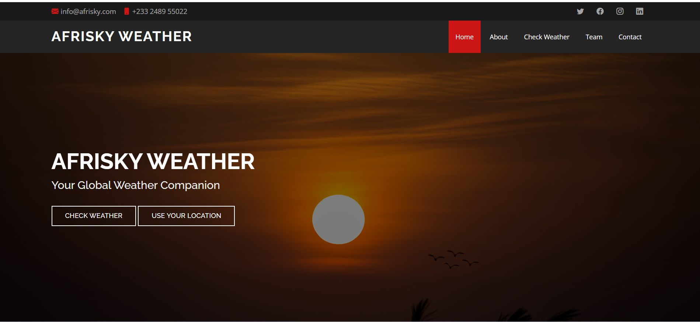
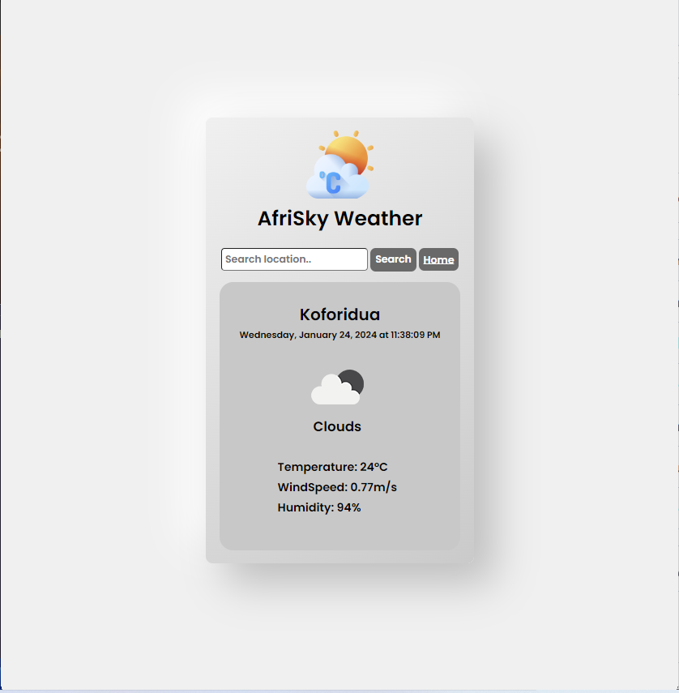
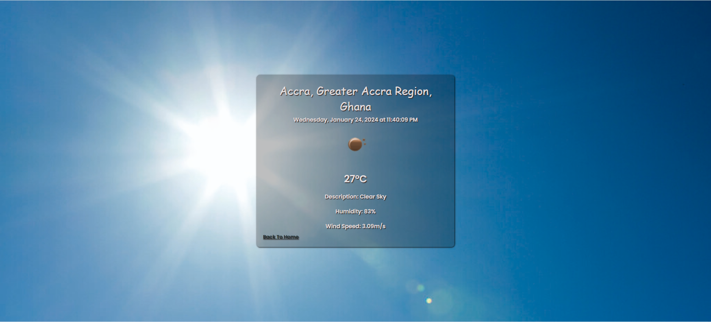

# AfriSky Weather

## Table of Contents
- [Introduction](#introduction-globe_with_meridians)
- [Inspiration](#inspiration-sparkles)
- [Technical Challenges](#technical-challenges-hammer_and_wrench)
- [Live Demo](#live-demo-rocket)
- [Authors](#authors-busts_in_silhouette)
- [Technology](#technology-computer)
- [Features](#features-star)
- [Installation](#installation-hammer_and_wrench)
    - [On the Terminal](#on-the-terminal)
    - [On Visual Studio Code](#on-visual-studio-code)
- [Usage](#usage-rocket)
- [Deployment](#deployment-rocket)
- [Dependencies](#dependencies-package)
- [Next Iterations](#next-iterations)
    - [1. 5-Day Weather Forecast](#1-5-day-weather-forecast)
    - [2. Interactive Map Integration](#2-interactive-map-integration)
    - [3. Temperature Unit Selection](#3-temperature-unit-selection)
- [Contributing](#contributing-handshake)
    - [How to Contribute](#how-to-contribute)
    - [Code Style](#code-style)
    - [Pull Requests](#pull-requests)
- [License](#license-page_facing_up)
- [Acknowledgments](#acknowledgments-pray)
- [Screenshots](#screenshots-camera)
- [Conclusion](#conclusion-tada)

## Introduction :globe_with_meridians:

AfriSky Weather is a simple and intuitive weather application that provides real-time weather information for cities around the world. The app utilizes the OpenWeatherMap API to fetch accurate and up-to-date weather data.

AfriSky Weather is more than just a weather application; it's a collaborative endeavor born out of the shared passion of three innovators—Freda Tsorme-Dzebu, Matilda Dogbatsey, and Rosina Antwi. Our goal was to create a weather companion that not only delivered real-time updates but also added a personalized touch to enhance the user experience.

## Inspiration :sparkles:

The inspiration for AfriSky Weather arose from our collective fascination with the intersection of technology and meteorology. As weather enthusiasts and nature lovers, we envisioned a tool that not only provided accurate weather information but also reflected the beauty and diversity of nature through a simple and user-friendly interface.

## Technical Challenges :hammer_and_wrench:

The journey to create AfriSky Weather was not without its challenges. One significant hurdle was perfecting the responsive design to ensure a consistent and enjoyable user experience across various devices. Additionally, integrating external services like OpenWeatherMap posed complexities that required thorough collaboration, documentation study, and problem-solving.

## Live Demo :rocket:
Check out the live demo of the app deployed on Firebase: [AfriSky Weather App](https://skyweather002.web.app)
You can read our blog post [here](https://medium.com/@rosinaantwi96/navigating-weather-wonders-the-afrisky-weather-app-journey-d4570c379f22 )

## Authors :busts_in_silhouette:

Connect with the Authors on Linkedin:
- [Matilda Dogbatsey](https://www.linkedin.com/in/matilda-dogbatsey)
- [Rosina Antwi](https://www.linkedin.com/in/rosina-antwi-61a130271) 
- [Freda Tsorme-Dzebu](www.linkedin.com/in/freda-tsorme-dzebu-1498b0a7) 

## Technology :computer:

## Features :star:

- *Current Weather Display:* Get instant access to the current weather conditions, including temperature, description, and wind speed.
- *Search Functionality:* Easily search for weather information by city name.
- *Use Your Location:* Use geolocation feature to check weather information.
- *Dynamic Backgrounds:* The app dynamically changes its background based on the current weather conditions.
- *Responsive Design:* The user interface is designed to be responsive, providing a seamless experience across various devices.

## Installation :hammer_and_wrench:
**On the terminal**
 1. *Install the following dependencies:*
       - [Node.js](https://nodejs.org/) installed on your machine.
       - [npm](https://www.npmjs.com/) (Node Package Manager) to manage project    dependencies.
 
 2. *Clone the Repository:*
       - `git clone https://github.com/KafuiPraise/AfriSky-Weather.git`
 
 3. *Navigate to the Project Directory:*
      - `cd AfriSky-Weather`
 
 4. *Run* `npm install` and `npm start`
 
 5. *Open your web browser and visit http://localhost:3000*

**On Visual Studio Code**
  1. *Clone the Repository:*
        - `git clone https://github.com/KafuiPraise/AfriSky-Weather.git`

  2. *Navigate to the Project Directory:*
         - `AfriSky-Weather`

  3. *Open a live server or preview index.html in Web Browser* 

## Usage :rocket:

- Click on the `Use Your Location` button to use the geolocation feature to fetch weather information. 
- Enter the city name in the search bar and press Enter to get the current weather information.
- The app dynamically updates the background image based on the weather conditions.
- Enjoy a visually appealing and informative weather experience.

## Deployment :rocket:

The app has been deployed on Firebase for easy access. Visit the live demo: [AfriSky Weather App](https://skyweather002.web.app)

## Dependencies :package:

- *OpenWeatherMap API:* The app relies on the OpenWeatherMap API to fetch weather data. You need to obtain an API key by signing up at [OpenWeatherMap](https://openweathermap.org/) and replace the placeholder in the weatherinfo.js file.
- *OpenCage Geocoding API:* The app also relies on the OpenCage Geocoding API to fetch user location for the geolocation feature. You can get an api key [here](https://opencagedata.com/)

## Next Iterations

### 1. **5-Day Weather Forecast**

**Objective:** :thinking: Provide users with a comprehensive outlook by integrating a 5-day weather forecast feature.

**Implementation:** Leveraging OpenWeatherMap's API, we aim to fetch extended weather forecasts, offering insights into temperature trends, precipitation, and more over the next five days. Users can plan their activities with a more detailed understanding of the weather.

### 2. **Interactive Map Integration**

**Objective:** :thinking: Enhance user engagement by incorporating an interactive map feature.

**Implementation:** The inclusion of an interactive map will allow users to visually explore weather patterns and conditions in different regions. This dynamic feature provides an intuitive and engaging way for users to interact with weather information.

### 3. **Temperature Unit Selection**

**Objective:** :thinking: Cater to user preferences by allowing them to choose between Celsius and Fahrenheit for temperature readings.

**Implementation:** We will introduce a user-friendly setting that enables users to switch between temperature units based on their preference. This customization feature ensures a personalized experience, allowing users to view temperature data in their preferred units.

## Contributing :handshake: 

Contributions are welcome! If you have any ideas, bug fixes, or improvements, feel free to contribute. Here's how you can get involved:

### 1. **How to Contribute**
1. Fork the repository.
2. Create a new branch for your feature or bug fix: `git checkout -b your-branch-name`.
3. Make your changes and commit them: `git commit -m 'Add your feature'`.
4. Push to the branch: `git push origin your-branch-name`.
5. Open a pull request.

### 2. **Code Style**
When contributing code, please follow the existing code style to maintain consistency.

### 3. **Pull Requests**
Submit a pull request. Clearly describe the purpose of your pull request and any relevant information.
Let's make this project better together!

## License :page_facing_up:

AfriSky Weather is an open-source project released under the MIT License.

## Acknowledgments :pray:

- The app utilizes the OpenWeatherMap and OpenCage Geocoding APIs for providing weather data and geolocation details respectively.
- Background images are sourced from Unsplash and adapted for use in the app.
- Background images on the landing page are original shots by Matilda Dogbatsey

## Screenshots :camera:

## Conclusion :tada:

AfriSky Weather is not just an app; it's a continuously evolving project. Stay tuned for these exciting features that will make AfriSky Weather an even more indispensable tool for weather enthusiasts around the globe.

---

*Join us on this journey of improvement and innovation. Your input helps us shape AfriSky Weather into a weather companion that exceeds expectations.*
